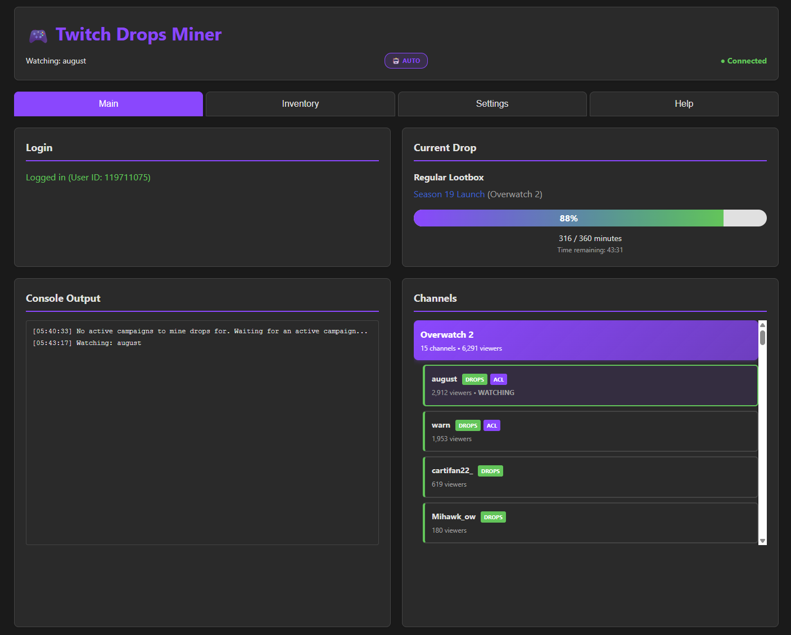

# 🌟 Twitch Drops Miner (TDM)

> 🎮 **Automate Twitch Drop Farming — Effortlessly, Headlessly, and Bandwidth-Free**

<p align="center">
  <a href="https://github.com/rangermix/TwitchDropsMiner/stargazers"></a>
  <a href="https://github.com/rangermix/TwitchDropsMiner/releases"></a>
  <a href="https://hub.docker.com/r/rangermix/twitch-drops-miner"></a>
  <a href="https://github.com/rangermix/TwitchDropsMiner/blob/main/LICENSE"></a>
  <a href="https://www.python.org/downloads/"></a>
</p>

A modern, AI-assisted fork of [DevilXD/TwitchDropsMiner](https://github.com/DevilXD/TwitchDropsMiner) — rebuilt for reliability, simplicity, and automation.  
**Twitch Drops Miner** lets you automatically farm Twitch drops without ever opening a stream.  
No more tab juggling, channel switching, or missing rewards — just set it, forget it, and collect.

---

## ✨ Features

- 🚀 **Streamless Mining** — Earn drops without streaming video (save bandwidth)
- 🔍 **Automatic Campaign Discovery** — Detects new drop events automatically
- ⚙️ **Auto Channel Switching** — Always mines the best available stream
- 💾 **Persistent Login** — OAuth login saved via cookies
- 🕹️ **Simple Web UI** — Manage everything from your browser
- 🧩 **Docker-Ready** — One command to deploy anywhere

---

## 🧰 Quick Start (Docker Recommended)

### 🐳 Using Pre-Built Image (Docker run)

```bash
docker pull rangermix/twitch-drops-miner:latest
docker run -d -p 8080:8080 -v $(pwd)/data:/app/data rangermix/twitch-drops-miner:latest
```

### 📦 Using Docker Compose

```yaml
services:
  twitch-drops-miner:
    image: rangermix/twitch-drops-miner:latest
    ports:
      - "8080:8080"
    volumes:
      - ./data:/app/data
      # optional, use if you want to persist logs
      - ./logs:/app/logs
    environment:
      # Set timezone (optional, defaults to UTC)
      - TZ=Australia/Sydney
    restart: unless-stopped
```

### 🧑‍💻 From Source (for Developers)

```bash
# Python 3.10+
pip install -e .
python main.py
```

Visit 👉 **<http://localhost:8080>**

---

## 🌈 Using the Web App

1. Open `http://localhost:8080`
2. Login with your Twitch account (OAuth device flow)
3. The miner auto-fetches available campaigns
4. Select games you want to farm → click **Reload**
5. TDM starts mining drops automatically 🎉

📝 **Tip:**  
Make sure your Twitch account is linked to your game accounts →  
👉 [https://www.twitch.tv/drops/campaigns](https://www.twitch.tv/drops/campaigns)

---

## ⚠️ Notes & Warnings

> ⚠️ **Avoid Watching on the Same Account**  
> Watching Twitch manually while the miner runs can cause progress desync.  
> Use a different account if you want to watch live streams while mining.

> 💡 **Requirements**  
> Python 3.10+  
> Docker optional but recommended  
> Persistent data stored in `/data`

---

## 🖼️ Screenshot


> A clean, modern web UI lets you control everything from your browser.

---

## 💖 Support the Project

If TwitchDropsMiner saves you time or bandwidth, please consider supporting continued development:

<div align="center">

[](https://buymeacoffee.com/rangermix)

⭐ **Star this repo** → it really helps visibility!  
💬 [Open an issue](../../issues) or [submit a PR](../../pulls) if you want to contribute.

</div>

You can also support the original author [@DevilXD](https://github.com/DevilXD):  
👉 [buymeacoffee.com/DevilXD](https://www.buymeacoffee.com/DevilXD) or [Patreon](https://www.patreon.com/bePatron?u=26937862).

---

## 🎯 Project Goals

| Goal | Description |
|------|--------------|
| 🎯 **Focus** | Twitch Drops automation |
| 🧩 **Ease of Use** | Simple web UI |
| 🛡️ **Reliability** | Designed for continuous operation |
| ⚙️ **Efficiency** | Minimal API calls, Twitch-friendly |
| 🐳 **Deployment** | Docker-first, headless operation |

---

## 🙏 Acknowledgments

This project is a fork of the brilliant [TwitchDropsMiner](https://github.com/DevilXD/TwitchDropsMiner) by [@DevilXD](https://github.com/DevilXD).  
Huge thanks to DevilXD and all contributors who built the foundation.

For detailed translation and contribution credits, see [Acknowledgments](#original-project-credits) below.

---

## 🧾 Disclaimer

> ⚙️ This fork is heavily maintained and developed using AI-assisted coding (Claude Code).  
> While stable, the codebase reflects “vibe coding” patterns — always review changes before deployment.  
> Use responsibly.

---

## 🧑‍💻 Original Project Credits

<!---
Note: The translations credits are sorted alphabetically, based on their English language name.
When adding a new entry, please ensure to insert it in the correct place in the second section.
Non-translations related credits should be added to the first section instead.

Note: When adding a new credits line below, please add two trailing spaces at the end
of the previous line, if they aren't already there. Doing so ensures proper markdown
rendering on Github. In short: Each credits line should end with two trailing spaces,
placed past the period character at the end.

• Last line can have the two trailing spaces omitted.
• Please ensure your editor won't trim the trailing spaces upon saving the file.
• Please ensure to leave a single empty new line at the end of the file.
-->

@guihkx - For the CI script, CI maintenance, and everything related to Linux builds.  
@kWAYTV - For the implementation of the dark mode theme.  

@Bamboozul - For the entirety of the Arabic (العربية) translation.  
@Suz1e - For the entirety of the Chinese (简体中文) translation and revisions.  
@wwj010 - For the Chinese (简体中文) translation corrections and revisions.  
@zhangminghao1989 - For the Chinese (简体中文) translation corrections and revisions.  
@Ricky103403 - For the entirety of the Traditional Chinese (繁體中文) translation.  
@LusTerCsI - For the Traditional Chinese (繁體中文) translation corrections and revisions.  
@nwvh - For the entirety of the Czech (Čeština) translation.  
@Kjerne - For the entirety of the Danish (Dansk) translation.  
@roobini-gamer - For the entirety of the French (Français) translation.  
@Calvineries - For the French (Français) translation revisions.  
@ThisIsCyreX - For the entirety of the German (Deutsch) translation.  
@Eriza-Z - For the entirety of the Indonesian translation.  
@casungo - For the entirety of the Italian (Italiano) translation.  
@ShimadaNanaki - For the entirety of the Japanese (日本語) translation.  
@Patriot99 - For the Polish (Polski) translation and revisions (co-authored with @DevilXD).  
@zarigata - For the entirety of the Portuguese (Português) translation.  
@Sergo1217 - For the entirety of the Russian (Русский) translation.  
@kilroy98 - For the Russian (Русский) translation corrections and revisions.  
@Shofuu - For the entirety of the Spanish (Español) translation and revisions.  
@alikdb - For the entirety of the Turkish (Türkçe) translation.  
@Nollasko - For the entirety of the Ukrainian (Українська) translation and revisions.  
@kilroy98 - For the Ukrainian (Українська) translation corrections and revisions.  
