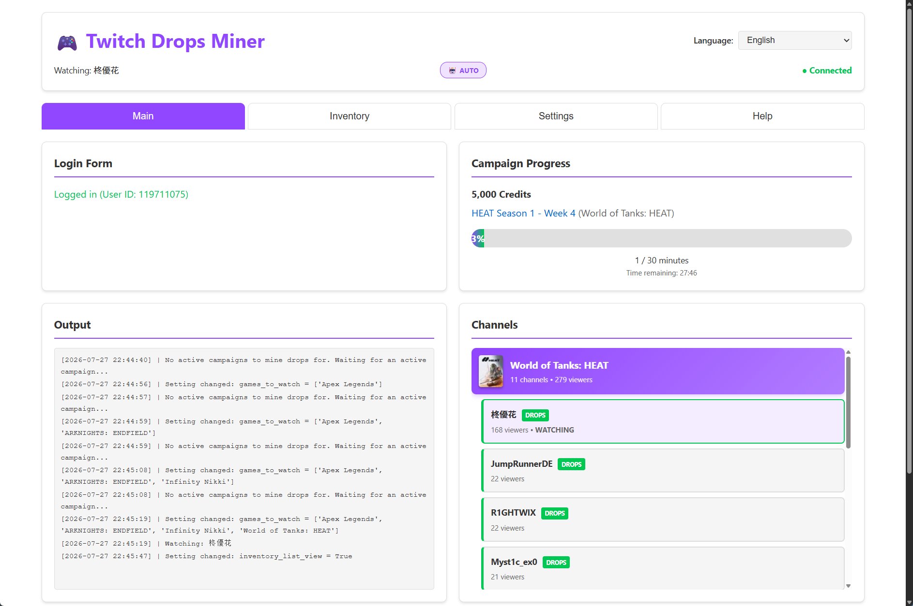

# Twitch Drops Miner

> Automatically mine timed Twitch Drops without streaming video or audio.

<p align="center">
  <a href="https://github.com/rangermix/TwitchDropsMiner/stargazers"></a>
  <a href="https://github.com/rangermix/TwitchDropsMiner/releases"></a>
  <a href="https://hub.docker.com/r/rangermix/twitch-drops-miner"></a>
  <a href="https://github.com/rangermix/TwitchDropsMiner/blob/main/LICENSE"></a>
  <a href="https://www.python.org/downloads/"></a>
</p>

Twitch Drops Miner is a low-bandwidth, headless application that discovers eligible
campaigns, selects an appropriate live channel, and tracks drop progress from a web
dashboard. It sends Twitch watch events without downloading the stream itself.



## Features

- **Low-bandwidth mining** — progresses timed drops without downloading video or audio
- **Automatic campaign discovery** — detects active and upcoming drop campaigns
- **Smart channel selection** — prioritizes eligible channels, preferred games, and viewers
- **Persistent sessions** — saves OAuth login state between runs
- **Web dashboard** — manages campaigns, channels, inventory, settings, and login status
- **Headless deployment** — runs locally, remotely, or in Docker without a desktop GUI
- **Safe rendering** — builds dynamic translated content with DOM APIs instead of raw HTML

## Quick start

### Docker (recommended)

Docker stores persistent application data in `/app/data`. The command below binds that
directory to `./data` on the host:

```bash
docker run -d \
  --name twitch-drops-miner \
  -p 8080:8080 \
  -v "${PWD}/data:/app/data" \
  --restart unless-stopped \
  rangermix/twitch-drops-miner:latest
```

Open <http://localhost:8080>.

### Docker Compose

From the repository root, build and start the included
[`docker-compose.yml`](./docker-compose.yml):

```bash
docker compose up -d --build
```

### From source

Source installations require Python 3.12 or newer and
[`uv`](https://docs.astral.sh/uv/):

```bash
uv sync
uv run main.py
```

Then open <http://localhost:8080>.

## Using the web app

1. Log in with your Twitch account through the OAuth device flow.
2. Wait for the miner to discover available campaigns.
3. Choose the games you want to prioritize. You can also search for a game, select
   **Add Game**, and then select **Reload**.
4. Leave the miner running while it selects eligible channels and tracks drop progress.

Inventory filters combine **Active**, **Upcoming**, and **Expired** as alternatives.
**Not Linked** narrows that status result, while fully claimed campaigns stay hidden
until **Finished** is selected. Zero-minute subscription rewards are omitted from the
Inventory and Wanted Drops Queue because they cannot be earned by watching. The channel
list matches game names case-insensitively and keeps the actively watched channel visible
while game settings are changing. Campaign totals and claim messages count only rewards
that can be earned by watching.

> [!NOTE]
> Your Twitch account must be linked to the relevant game accounts. Review your
> [Twitch Drops campaigns](https://www.twitch.tv/drops/campaigns) before mining.

## Important notes

> [!WARNING]
> Avoid watching Twitch manually with the same account while the miner is running.
> Simultaneous viewing can cause drop-progress desynchronization.

- Docker data is stored inside the container at `/app/data`; the examples persist it
  to `./data` on the host.
- Source installations store persistent data in the repository's `data/` directory.
- Logs can be persisted separately by mounting `./logs:/app/logs`.

## Contributors

Contributors are credited automatically when their pull requests are merged into `main`.

<!-- contributors:start -->
| Contributor | Merged pull requests |
| --- | --- |
| [@birdhimself](https://github.com/birdhimself) | [#41](https://github.com/rangermix/TwitchDropsMiner/pull/41) |
| [@capkz](https://github.com/capkz) | [#70](https://github.com/rangermix/TwitchDropsMiner/pull/70) |
| [@EthanBlazkowicz](https://github.com/EthanBlazkowicz) | [#33](https://github.com/rangermix/TwitchDropsMiner/pull/33) |
| [@Knight-sys](https://github.com/Knight-sys) | [#3](https://github.com/rangermix/TwitchDropsMiner/pull/3) |
| [@rangermix](https://github.com/rangermix) | [#1](https://github.com/rangermix/TwitchDropsMiner/pull/1) · [#2](https://github.com/rangermix/TwitchDropsMiner/pull/2) · [#7](https://github.com/rangermix/TwitchDropsMiner/pull/7) · [#8](https://github.com/rangermix/TwitchDropsMiner/pull/8) · [#9](https://github.com/rangermix/TwitchDropsMiner/pull/9) · [#13](https://github.com/rangermix/TwitchDropsMiner/pull/13) · [#20](https://github.com/rangermix/TwitchDropsMiner/pull/20) · [#24](https://github.com/rangermix/TwitchDropsMiner/pull/24) · [#29](https://github.com/rangermix/TwitchDropsMiner/pull/29) · [#32](https://github.com/rangermix/TwitchDropsMiner/pull/32) · [#45](https://github.com/rangermix/TwitchDropsMiner/pull/45) · [#74](https://github.com/rangermix/TwitchDropsMiner/pull/74) · [#79](https://github.com/rangermix/TwitchDropsMiner/pull/79) · [#80](https://github.com/rangermix/TwitchDropsMiner/pull/80) · [#84](https://github.com/rangermix/TwitchDropsMiner/pull/84) · [#86](https://github.com/rangermix/TwitchDropsMiner/pull/86) |
| [@Sean-Destefano](https://github.com/Sean-Destefano) | [#49](https://github.com/rangermix/TwitchDropsMiner/pull/49) |
| [@SimpliAj](https://github.com/SimpliAj) | [#72](https://github.com/rangermix/TwitchDropsMiner/pull/72) |
| [@Stein-N](https://github.com/Stein-N) | [#71](https://github.com/rangermix/TwitchDropsMiner/pull/71) |
| [@vurmil](https://github.com/vurmil) | [#12](https://github.com/rangermix/TwitchDropsMiner/pull/12) · [#17](https://github.com/rangermix/TwitchDropsMiner/pull/17) |
<!-- contributors:end -->

## Support

If Twitch Drops Miner saves you time or bandwidth, you can support the project by:

- [starring the repository](https://github.com/rangermix/TwitchDropsMiner)
- [reporting an issue](https://github.com/rangermix/TwitchDropsMiner/issues) or
  [submitting a pull request](https://github.com/rangermix/TwitchDropsMiner/pulls)
- [buying the maintainer a coffee](https://buymeacoffee.com/rangermix)

## Credits

This project is a modern fork of
[DevilXD/TwitchDropsMiner](https://github.com/DevilXD/TwitchDropsMiner), created by
[@DevilXD](https://github.com/DevilXD). You can support the original author through
[Buy Me a Coffee](https://www.buymeacoffee.com/DevilXD) or
[Patreon](https://www.patreon.com/bePatron?u=26937862).

<details>
<summary>Original project and translation credits</summary>

### Original project contributions

- [@guihkx](https://github.com/guihkx) — CI scripts, CI maintenance, and Linux builds
- [@kWAYTV](https://github.com/kWAYTV) — dark mode theme

### Translation credits

- **Arabic** — [@Bamboozul](https://github.com/Bamboozul)
- **Chinese (Simplified)** — [@Suz1e](https://github.com/Suz1e),
  [@wwj010](https://github.com/wwj010), and
  [@zhangminghao1989](https://github.com/zhangminghao1989)
- **Chinese (Traditional)** — [@Ricky103403](https://github.com/Ricky103403) and
  [@LusTerCsI](https://github.com/LusTerCsI)
- **Czech** — [@nwvh](https://github.com/nwvh)
- **Danish** — [@Kjerne](https://github.com/Kjerne)
- **French** — [@roobini-gamer](https://github.com/roobini-gamer) and
  [@Calvineries](https://github.com/Calvineries)
- **German** — [@ThisIsCyreX](https://github.com/ThisIsCyreX)
- **Hungarian** — [@centipederat](https://github.com/centipederat)
- **Indonesian** — [@Eriza-Z](https://github.com/Eriza-Z)
- **Italian** — [@casungo](https://github.com/casungo)
- **Japanese** — [@ShimadaNanaki](https://github.com/ShimadaNanaki)
- **Polish** — [@Patriot99](https://github.com/Patriot99), co-authored with
  [@DevilXD](https://github.com/DevilXD)
- **Portuguese** — [@zarigata](https://github.com/zarigata)
- **Russian** — [@Sergo1217](https://github.com/Sergo1217) and
  [@kilroy98](https://github.com/kilroy98)
- **Spanish** — [@Shofuu](https://github.com/Shofuu)
- **Turkish** — [@alikdb](https://github.com/alikdb)
- **Ukrainian** — [@Nollasko](https://github.com/Nollasko) and
  [@kilroy98](https://github.com/kilroy98)

</details>

## Development disclosure

This fork is maintained with AI-assisted development tools. Changes are validated through
automated tests and code-quality checks, but users should still review updates before
deploying them. The validation suite includes GraphQL watch events and batched channel
discovery, alongside settings, full-locale translation schema and placeholder checks,
and frontend safety checks. Use the software
responsibly. Release automation verifies that the runtime, package, and lockfile versions
match before publishing tags and Docker images.
