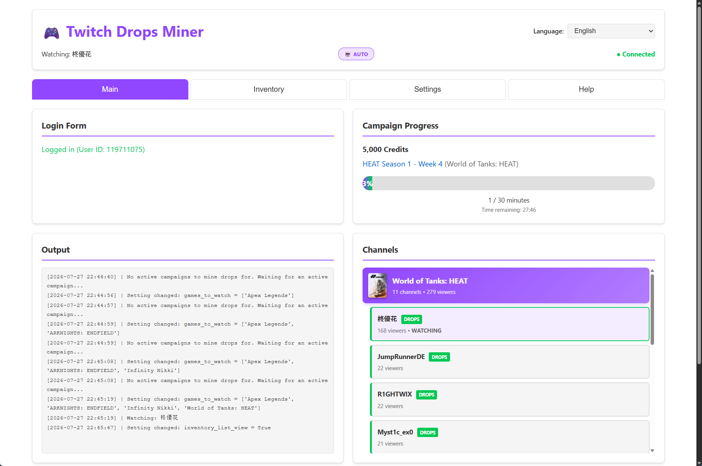

# Twitch Drops Miner

Automatically earn timed Twitch Drops without downloading stream video or audio.

<p align="center">
  <a href="https://github.com/rangermix/TwitchDropsMiner/stargazers"></a>
  <a href="https://github.com/rangermix/TwitchDropsMiner/releases"></a>
  <a href="https://hub.docker.com/r/rangermix/twitch-drops-miner"></a>
  <a href="https://github.com/rangermix/TwitchDropsMiner/blob/main/LICENSE"></a>
  <a href="https://www.python.org/downloads/"></a>
</p>

TDM discovers eligible campaigns, selects live channels, and tracks and claims rewards
from a web dashboard. Run it on your own computer or home server. This hobby project
supports personal use on your own hardware and home network; third-party hosting and
services operated for other users are outside its support scope.



- Choose and prioritize games, or let TDM discover available campaigns.
- Track campaigns and rewards, and ignore drops you do not want.
- Sign in inside the dashboard; TDM saves and renews your session automatically.
- Review claimed-drop history, export it to CSV, and receive Telegram notifications.
- Manage everything from a web dashboard with optional password protection.

## Quick start

With Docker installed, choose one setup below. Shell examples use Bash
(Linux, macOS, or WSL).

### Docker run

Pull and start the published image:

```bash
docker pull rangermix/twitch-drops-miner:2.1.0
docker run -d \
  --name twitch-drops-miner --init --stop-timeout 30 --shm-size 256m \
  -p 8080:8080 -e TZ=Australia/Sydney \
  -v "${PWD}/data:/app/data" \
  --restart unless-stopped \
  rangermix/twitch-drops-miner:2.1.0
```

### Docker Compose

For a new installation, create a dedicated folder and save this as `compose.yaml`
inside it. Set `TZ` to your home internet connection's timezone:

```yaml
services:
  twitch-drops-miner:
    image: rangermix/twitch-drops-miner:2.1.0
    container_name: twitch-drops-miner
    init: true
    stop_grace_period: 30s
    shm_size: 256m
    ports:
      - "8080:8080"
    volumes:
      - ./data:/app/data
      - ./logs:/app/logs
    environment:
      TZ: Australia/Sydney
    restart: unless-stopped
```

From that folder, pull and start the image:

```bash
docker compose pull && docker compose up -d
```

For either setup, open <http://localhost:8080>, or `http://YOUR-SERVER:8080` from
another device on your home network. Keep the `data` directory when updating.
For Compose management, source builds, and switching an existing installation to
Compose, see the [installation guide](docs/installation.md#docker-compose).

## Sign in

1. Open the dashboard. When Twitch login is required, TDM shows its container browser
   and the Twitch sign in page automatically.
2. Sign in and complete any Twitch verification inside that browser. Select **Finish
   sign in** (or close the Chromium window) after Twitch confirms you are signed in.
3. TDM verifies your account and campaign access, saves the session, and returns to
   the normal dashboard. Select your games there.

Set Docker’s `TZ` to match your home internet connection’s timezone; change
`Australia/Sydney` in the example as needed. Chromium and the temporary display are
included in the image. Your everyday browser profile is separate.
TDM renews the session automatically. **Settings → Log out of Twitch**, at the
bottom, clears this miner’s session and opens sign in again for account replacement.
See [authentication](docs/authentication.md) and [troubleshooting](docs/troubleshooting.md).
The integrated login is included in [v2.1.0](https://github.com/rangermix/TwitchDropsMiner/releases/tag/v2.1.0).

## Updating Docker

### With docker run

For the `docker run` setup above, run this from the **same folder** so `${PWD}/data`
still points to your existing data. Keep your own timezone and any custom container
name, ports, mounts, or environment options when adapting the commands.
Review the [release notes](https://github.com/rangermix/TwitchDropsMiner/releases) first.

```bash
docker pull rangermix/twitch-drops-miner:latest &&
docker stop --timeout 30 twitch-drops-miner &&
docker rm twitch-drops-miner &&
docker run -d \
  --name twitch-drops-miner --init --stop-timeout 30 --shm-size 256m \
  -p 8080:8080 -e TZ=Australia/Sydney \
  -v "${PWD}/data:/app/data" \
  --restart unless-stopped \
  rangermix/twitch-drops-miner:latest
```

This replaces the container while keeping the mounted data. `latest` selects the
current stable image when you pull; it does not update automatically. To choose a
specific release, replace `latest` in both places with its version tag.

### With Docker Compose

For the published-image setup above, change the `image:` tag in `compose.yaml` to
the release you want, or use `latest`. From the folder containing that file, run:

```bash
docker compose pull && docker compose up -d
```

For the repository's source-building `docker-compose.yml`, run this from your
original Git clone on the branch you intend to update:

```bash
git pull --ff-only && docker compose up -d --build
```

This builds that branch's source, which may be newer than the published release, and
reuses the configured data/log mounts. For named volumes, custom Compose files, and
backup guidance, see [detailed update steps](docs/installation.md#persistent-data-and-upgrades).

## Upgrading to v2.0

Keep your existing `data` directory, including `cookies.jar`, and the same Docker volume.
A working Android session is restored automatically. If you used the Smart TV login in
v1.3.1/v1.3.2, your session has expired, or you are signed out, sign in using the dashboard browser. Follow the [v2.0 migration steps](https://github.com/rangermix/TwitchDropsMiner/releases/tag/v2.0.0)
when updating your container or source installation.

## User guides

Browse the [GitHub wiki](https://github.com/rangermix/TwitchDropsMiner/wiki) or read the
same guides in [docs](docs/README.md):

- [Installation and updates](docs/installation.md)
- [Login, migration, and recovery](docs/authentication.md)
- [Games, campaigns, inventory, and history](docs/usage.md)
- [Dashboard password and reverse proxies](docs/dashboard-access.md)
- [Telegram notifications](docs/notifications.md)
- [Troubleshooting](docs/troubleshooting.md)

## Help and contributions

Search [existing issues](https://github.com/rangermix/TwitchDropsMiner/issues) before
reporting a problem. Use the [bug-report form](https://github.com/rangermix/TwitchDropsMiner/issues/new?template=bug_report.yml)
with the running app version, hosting environment, reproduction steps, and redacted evidence.
See [CONTRIBUTING.md](CONTRIBUTING.md) for bug reports, translations,
and development. This fork uses AI-assisted development with automated checks and
independent review.

Based on [DevilXD/TwitchDropsMiner](https://github.com/DevilXD/TwitchDropsMiner).
See [credits](docs/credits.md) for the original project and translation contributors.
You can support this fork by [starring it](https://github.com/rangermix/TwitchDropsMiner)
or [buying the maintainer a coffee](https://buymeacoffee.com/rangermix).

## Contributors

<details>
<summary>People who contributed merged pull requests</summary>

<!-- contributors:start -->
| Contributor | Merged pull requests |
| --- | --- |
| [@3lb0z0](https://github.com/3lb0z0) | [#110](https://github.com/rangermix/TwitchDropsMiner/pull/110) |
| [@birdhimself](https://github.com/birdhimself) | [#41](https://github.com/rangermix/TwitchDropsMiner/pull/41) |
| [@capkz](https://github.com/capkz) | [#70](https://github.com/rangermix/TwitchDropsMiner/pull/70) |
| [@EthanBlazkowicz](https://github.com/EthanBlazkowicz) | [#33](https://github.com/rangermix/TwitchDropsMiner/pull/33) |
| [@Klages](https://github.com/Klages) | [#94](https://github.com/rangermix/TwitchDropsMiner/pull/94) · [#95](https://github.com/rangermix/TwitchDropsMiner/pull/95) |
| [@Knight-sys](https://github.com/Knight-sys) | [#3](https://github.com/rangermix/TwitchDropsMiner/pull/3) |
| [@rangermix](https://github.com/rangermix) | [#1](https://github.com/rangermix/TwitchDropsMiner/pull/1) · [#2](https://github.com/rangermix/TwitchDropsMiner/pull/2) · [#7](https://github.com/rangermix/TwitchDropsMiner/pull/7) · [#8](https://github.com/rangermix/TwitchDropsMiner/pull/8) · [#9](https://github.com/rangermix/TwitchDropsMiner/pull/9) · [#13](https://github.com/rangermix/TwitchDropsMiner/pull/13) · [#20](https://github.com/rangermix/TwitchDropsMiner/pull/20) · [#24](https://github.com/rangermix/TwitchDropsMiner/pull/24) · [#29](https://github.com/rangermix/TwitchDropsMiner/pull/29) · [#32](https://github.com/rangermix/TwitchDropsMiner/pull/32) · [#45](https://github.com/rangermix/TwitchDropsMiner/pull/45) · [#74](https://github.com/rangermix/TwitchDropsMiner/pull/74) · [#79](https://github.com/rangermix/TwitchDropsMiner/pull/79) · [#80](https://github.com/rangermix/TwitchDropsMiner/pull/80) · [#84](https://github.com/rangermix/TwitchDropsMiner/pull/84) · [#86](https://github.com/rangermix/TwitchDropsMiner/pull/86) · [#88](https://github.com/rangermix/TwitchDropsMiner/pull/88) · [#93](https://github.com/rangermix/TwitchDropsMiner/pull/93) · [#89](https://github.com/rangermix/TwitchDropsMiner/pull/89) · [#90](https://github.com/rangermix/TwitchDropsMiner/pull/90) · [#91](https://github.com/rangermix/TwitchDropsMiner/pull/91) · [#92](https://github.com/rangermix/TwitchDropsMiner/pull/92) · [#104](https://github.com/rangermix/TwitchDropsMiner/pull/104) · [#105](https://github.com/rangermix/TwitchDropsMiner/pull/105) · [#116](https://github.com/rangermix/TwitchDropsMiner/pull/116) · [#119](https://github.com/rangermix/TwitchDropsMiner/pull/119) · [#120](https://github.com/rangermix/TwitchDropsMiner/pull/120) · [#124](https://github.com/rangermix/TwitchDropsMiner/pull/124) · [#125](https://github.com/rangermix/TwitchDropsMiner/pull/125) · [#126](https://github.com/rangermix/TwitchDropsMiner/pull/126) · [#127](https://github.com/rangermix/TwitchDropsMiner/pull/127) · [#131](https://github.com/rangermix/TwitchDropsMiner/pull/131) · [#133](https://github.com/rangermix/TwitchDropsMiner/pull/133) · [#145](https://github.com/rangermix/TwitchDropsMiner/pull/145) · [#146](https://github.com/rangermix/TwitchDropsMiner/pull/146) · [#149](https://github.com/rangermix/TwitchDropsMiner/pull/149) · [#153](https://github.com/rangermix/TwitchDropsMiner/pull/153) |
| [@Sean-Destefano](https://github.com/Sean-Destefano) | [#49](https://github.com/rangermix/TwitchDropsMiner/pull/49) |
| [@SimpliAj](https://github.com/SimpliAj) | [#72](https://github.com/rangermix/TwitchDropsMiner/pull/72) |
| [@Stein-N](https://github.com/Stein-N) | [#71](https://github.com/rangermix/TwitchDropsMiner/pull/71) |
| [@vurmil](https://github.com/vurmil) | [#12](https://github.com/rangermix/TwitchDropsMiner/pull/12) · [#17](https://github.com/rangermix/TwitchDropsMiner/pull/17) · [#18](https://github.com/rangermix/TwitchDropsMiner/pull/18) · [#100](https://github.com/rangermix/TwitchDropsMiner/pull/100) |
<!-- contributors:end -->

</details>
